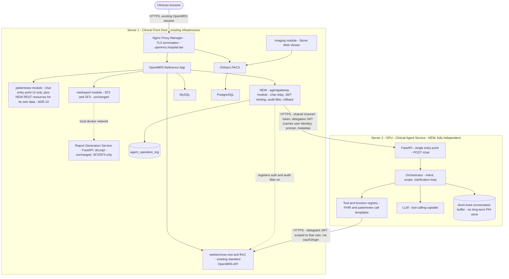
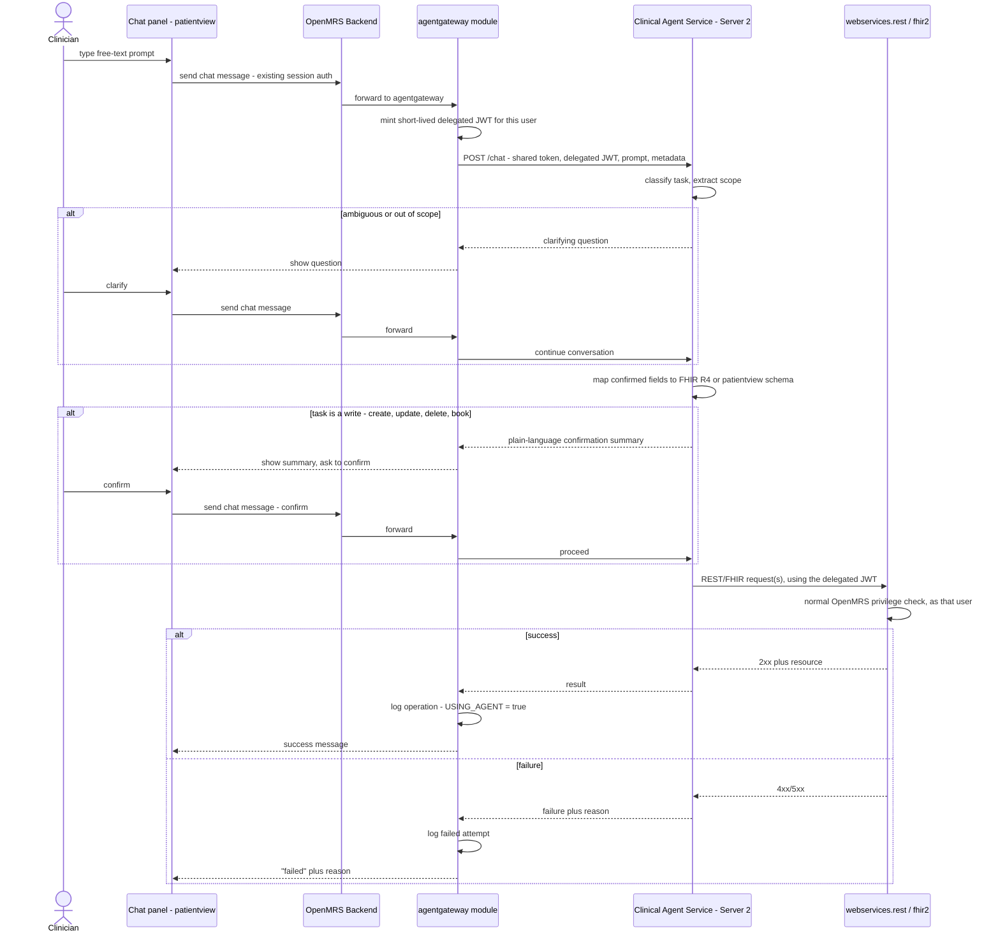
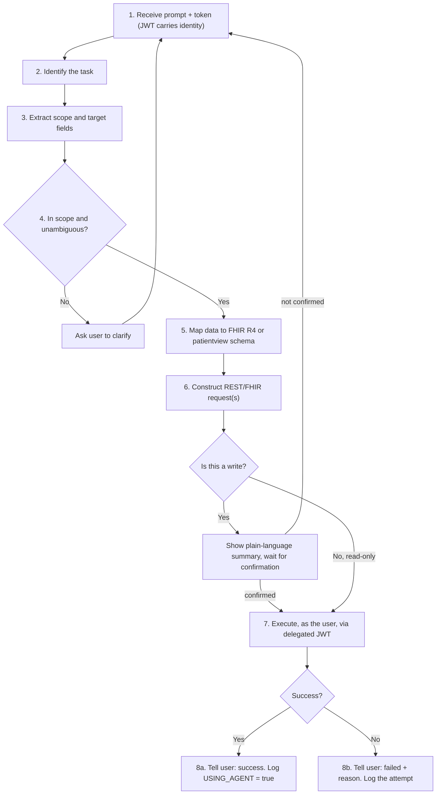

# Chatbot Agent — Architecture & Design Document

**Project:** OpenMRS–Orthanc Integration, Neurosurgery Department, CHU Blida
**Scope:** Part A of the original combined document — a conversational agent that performs OpenMRS operations from natural-language prompts, built as a fully independent service.
**Companion document:** `reportmed_archi.md` covers Part B — the two report-generation sub-features (SF2, SF3).
**Status:** Draft for team review — supersedes `medreport-architecture.md`, not yet implemented.

> This file is a split of the original combined document `Chatbot_and_report_architecture.md`. Nothing has been removed or reworded — content concerning the Agent (Part A) is collected here; content concerning the report-generation sub-features (Part B) is in `reportmed_archi.md`. Cross-cutting sections (diagrams, build order) are reproduced in both files for readability.

**Revision note:** This revision removes the "prompt → new patient" capability (formerly Sub-feature 1) from the `medreport` module entirely and redesigns it as its own system, per your direction. Sub-features 2 and 3 (one-click dashboard report, per-image report) are carried over as originally specified — see `reportmed_archi.md` §1.1, §5.1/§5.2 and the rows marked _unchanged_ in `reportmed_archi.md` §6/§7.

**Revision note 2:** This revision (a) removes the standalone plaintext `user id` field from the Server 1 → Server 2 `/chat` request — see ADR-13 — and (b) resolves six of the seven open questions from §8 per your answers: GPU VRAM (→ MedGemma 4B), orchestrator count (→ single agent for now), network topology (→ same LAN), rollback coverage (→ coherence-based rule, admin-only, full logging), `fhir2` coverage (→ no hardcoding, live `/metadata` only), and SF2/SF3 rendering (→ unified renderer, see `reportmed_archi.md`). Item 7 (`Rapport_3` privileges, report module) remains open and unrelated to this redesign.

---

## 0. Grounding: what changed and why

Two things in your brief change the shape of the system, not just where the code lives:

1. **The direction of coupling flips.** In the old design, _OpenMRS called out_ to a GPU-side extraction endpoint and then persisted the result itself, through a bespoke `medreport/confirm` endpoint. In your design, the _agent calls into_ OpenMRS's own web API to perform the operation — it has to, because "add a patient," "get information," "update a patient," and "book an appointment" are four different targets, not one. That only works if OpenMRS already exposes a generic, already-privilege-checked API surface covering all of them, which it does: `webservices.rest` (`/ws/rest/v1/...`) and the `fhir2` module (`/ws/fhir2/R4/...`). So the agent is built as a **client** of that existing surface, not as a data source feeding a purpose-built confirmation endpoint.
2. **"International Standard for Medical Data format" is HL7 FHIR.** OpenMRS ships this natively via `fhir2`, and its documentation currently lists Patient, Encounter, Observation, MedicationRequest and more among the supported resources. That covers demographics, encounters, and general clinical observations well. It does **not** cover the neurosurgery-specific fields: `patientview`'s eight clinical entities (GCS, Karnofsky, antecedents, exam findings, diagnosis, anatomopathology) are plain Hibernate-mapped Java classes, not OpenMRS's Concept/Obs model — the earlier draft already flagged this, and it's still true. FHIR has no resource shape for them. See ADR-10.
3. **The "shared token" you described doesn't need to be invented from scratch.** OpenMRS already has a module, `openmrs-module-oauth2login`, that does exactly this: a third-party system presents a signed JWT, OpenMRS verifies it and maps it to an existing local user, and every privilege check downstream runs as that user. That's the natural fit for "user id, for permissions." See ADR-9.

One place I diverged from the literal pseudocode, in the same spirit as the earlier draft's own pushbacks: your step 4 asks for confirmation only when a task is _ambiguous or out of scope_. I added a second, narrower gate — the agent must show a plain-language summary and get an explicit "yes" before executing any **write** (create/update/delete/book), even when the request was perfectly clear. Read-only lookups don't need this. An LLM confidently misreading "GCS s'est aggravé à 6" as "set GCS to 6" instead of "flag this and ask" is a patient-safety issue whether it happens behind a form (the old design) or inside a chat turn (this one) — I don't think the redesign changes that risk, so I kept the safeguard. Flagging it explicitly so you can override it if you disagree.

---

## 1. Requirements

### 1.1 Conversational Agent — functional requirements

| ID   | Requirement                                                                                                                                                                                                                                                                                                               |
| ---- | ------------------------------------------------------------------------------------------------------------------------------------------------------------------------------------------------------------------------------------------------------------------------------------------------------------------------- |
| CA1  | A clinician opens a chat panel (a link/tab surfaced from `patientview`, no chatbot logic implemented there) and types a free-text prompt covering the task families you described: add a patient, look something up, update a patient, book an appointment.                                                               |
| CA2  | The agent classifies the task and the fields/resources it targets before doing anything else.                                                                                                                                                                                                                             |
| CA3  | If the task is ambiguous or outside the agent's declared capability list, the agent asks a clarifying question in the chat instead of guessing, and waits for the next user turn (loop back to CA1).                                                                                                                      |
| CA4  | Read-only tasks (lookups) execute directly and return an answer — no confirmation step.                                                                                                                                                                                                                                   |
| CA5  | Any task that would create, update, delete, or book something shows the user a plain-language summary of exactly what will be written, and waits for explicit confirmation before the write is sent.                                                                                                                      |
| CA6  | On confirmation, the agent converts the confirmed data to FHIR R4 (for resources FHIR covers) or to `patientview`'s own schema (for neurosurgery-specific fields — GCS, Karnofsky, motor/pupil exam, antecedents, diagnosis, anatomopathology; see ADR-10), and issues the corresponding REST/FHIR request(s) to OpenMRS. |
| CA7  | Every OpenMRS call the agent makes runs under the **requesting clinician's own** OpenMRS privileges, never a shared service account — a user without patient-write privilege can't create a patient through the chat just because they can phrase a sentence.                                                             |
| CA8  | On success, the agent confirms in plain language what was done. On failure, it reports "failed" plus a specific, non-technical reason: insufficient permissions, patient not found, network/timeout, validation error. No raw stack traces reach the chat.                                                                |
| CA9  | Every agent-originated OpenMRS write is logged append-only, tagged `USING_AGENT = true`, with the acting user, the endpoint called, the request/response, and enough of a snapshot to reverse it where the target resource supports voiding.                                                                              |
| CA10 | An administrator can review the log and roll back a given operation.                                                                                                                                                                                                                                                      |

### 1.2 Non-functional requirements

- **No direct database access between Server 1 and Server 2, in either direction.** The Agent talks to OpenMRS exclusively through its already-existing, already-authenticated HTTP APIs (`webservices.rest`, `fhir2`) — never SQL, never a shared credential to MySQL.
- **The Agent is a fully independent service** with zero code dependency on `patientview` or `medreport`. The only OpenMRS-side code needed to support it is one small, generic module (`agentgateway`, §4.1) that has no neurosurgery-specific logic and could be reused by an unrelated department tomorrow.
- **Human confirmation is mandatory before any write** (CA5), not only before ambiguous ones — see §0.
- **Every write the Agent makes is individually attributable** to the human who confirmed it and to the fact that it went through the Agent (`USING_AGENT = true`), and is reversible wherever OpenMRS's own void semantics allow it.
- **Graceful degradation:** if Server 2 is down, the chat panel reports "assistant unavailable" and everything else — SF2, SF3, core OpenMRS/Orthanc, and ordinary manual data entry — keeps working exactly as before. Nothing about the Agent sits on the critical path of existing workflows.
- **All cross-server traffic over TLS**, reusing the certificate pattern already validated for Server 1 ↔ Server 2 traffic in the prior draft.
- Every new privilege follows the existing `App: <module>.<feature>[.manage]` convention.
- **A deliberate shift from the previous draft:** the old design tried to keep PHI entirely off Server 2 and out of any AI-adjacent log. That's no longer fully achievable once the Agent is the thing issuing writes — the audit trail (`agent_operation_log`, Server 1) will necessarily contain the prompt and the data it produced, because that's the only way an admin can review or roll back what happened. The mitigation is the same one the rest of this system already relies on: the durable, PHI-containing log lives on Server 1 — the existing system of record, already governed by OpenMRS's own access controls — not on Server 2, and Server 2 still keeps no long-term store of its own (see ADR-9, ADR-11).

### 1.3 Explicitly out of scope for v1

- Multi-step autonomous chains that execute several writes from one prompt without a confirmation per write. CA5 applies per mutating action, not per conversation.
- Automatic, unattended rollback. Rollback (CA10) is admin-triggered, one operation at a time.
- Duplicate-patient detection beyond calling OpenMRS's existing similar-patient search and surfacing matches as a warning before create-confirmation — same minimum safeguard as the prior draft.
- Fine-tuning the LLM; any language other than French for the chat UI.
- Multiple independently-deployed specialist agents (a separate "PatientAgent," "AppointmentAgent," etc.). **Resolved (§8): a single orchestrator handles this for now** — one agent with a tool/function registry (§4.2), simpler to secure, log, and reason about. Splitting into per-domain agents remains a possible v2 scaling decision, not a v1 requirement.

---

## 2. Key architecture decisions

> ADR-4, ADR-6, and ADR-8 concern the report module and are documented in `reportmed_archi.md` §2.

**ADR-1 — The Agent is a client of OpenMRS's standard REST/FHIR API, not a data source feeding a bespoke endpoint.**
The old design had Server 2 return JSON to a purpose-built `medreport/confirm` controller. That doesn't generalize to "get information / update a patient / book an appointment" — each would need its own bespoke endpoint, duplicating what `webservices.rest` and `fhir2` already do generically, with privilege checks already built in per resource. Recommendation: the Agent's tool registry (§4.2) targets the real, existing OpenMRS API surface directly. No new business-logic endpoints on the OpenMRS side for this feature at all — only the thin security/audit shim in ADR-5.

**ADR-2 — Confirm-before-write is mandatory for every mutating action, not only ambiguous ones.**
Your pseudocode gates confirmation on ambiguity (step 4). I extended it: any create/update/delete/book, even when the model is confident and the prompt was clear, must be summarized in plain language and explicitly confirmed before it's sent (CA5). This is the same non-negotiable human-in-the-loop principle the earlier draft established for patient data, just expressed as a chat turn instead of a review form. Not negotiable given it's patient data, but flagged here since it's a place I added to your spec rather than followed it literally — worth confirming you're on board.

**ADR-3 — The Report Generation Service stays out of the Agent's path entirely.**
Your pseudocode is about performing OpenMRS operations (CRUD-style), not producing a `.docx`. Unlike the old SF1, the Agent never calls the Report Generation Service — if a clinician wants a document after the Agent creates or updates a patient, that's a separate SF2 click. This is a simplification versus the old design, not just a relocation: one fewer cross-service call, one fewer failure mode, and the Report Generation Service (used by SF2/SF3, see `reportmed_archi.md`) never has to know the Agent exists.

**ADR-5 — `agentgateway`: a new, minimal, independent module for the Agent's entire OpenMRS-side footprint.**
"Independent service" doesn't mean _zero_ code on Server 1 — three things can only be enforced where the database and the privilege engine live: (1) turning a channel-level shared token into a specific user's actual OpenMRS permissions, (2) tagging and logging every Agent-originated write so `USING_AGENT = true` and rollback are possible, (3) giving an admin a rollback action. Putting this in `patientview` or `medreport` would re-couple the very thing you asked to decouple. Recommendation: one new, generic module, `agentgateway`, with no neurosurgery-specific logic in it at all — see §4.1. It's the smallest piece of Java that makes "independent service" actually safe rather than just organizationally tidy.

**ADR-7 — The model needs tool/function-calling, not just single-shot extraction.**
The old SF1 job was one-shot: sentence in, structured JSON out. The Agent's job (CA2–CA6) is agentic: classify, extract scope, decide whether to ask a question or proceed, pick and populate one or more concrete API calls, and interpret the result. That needs a model (or a model plus a thin orchestration loop) with reliable structured tool-calling, not just good extraction. Recommendation: keep MedGemma (still a defensible default for the medical-language understanding step — French clinical text → structured fields) but pair it with an explicit tool schema (the REST/FHIR call templates in §4.2) rather than free-form generation; verify tool-calling reliability against real prompts before committing, since this is a materially different capability than plain extraction. **Resolved (§8):** Server 2 has 16GB VRAM, which rules out the 27B variant for this workload once the tool-calling context and KV cache are accounted for alongside the model weights — **MedGemma 4B** is the sized choice. Tool-calling reliability at 4B should still be validated against real French clinical prompts before Phase 3 (§9) is considered done; if it can't hold up under the added structured-output workload, that's a reason to revisit prompting/constrained-decoding strategy, not VRAM.

**ADR-9 — Delegated authentication: a shared channel token plus a per-user JWT, never a shared service account.**
Two different trust boundaries, two different mechanisms:

- **Channel trust** (OpenMRS ↔ Agent, server-to-server): a shared secret (HMAC key or mTLS client cert), used only on this leg, never sent to a browser. It proves the request genuinely came from this hospital's OpenMRS instance — nothing more.
- **User trust** (does _this clinician_ have permission to do _this_): a short-lived JWT, minted by `agentgateway` at the start of each chat turn, containing the user id and an expiry of a few minutes. The Agent presents this JWT back to OpenMRS on every REST/FHIR call it makes. OpenMRS already has a module built for exactly this handoff — `openmrs-module-oauth2login` — which verifies a signed JWT's signature, reads the username from its payload, and authenticates the request as that existing local user, so every downstream privilege check (`patient.write`, etc.) runs unmodified (satisfies CA7). The Agent itself never holds a god-mode OpenMRS account; if the JWT expires mid-conversation, the call fails closed and the clinician is asked to re-confirm.
  This also resolves your "shared (non)persistent" token literally: the channel secret is long-lived but never leaves server-to-server traffic; the per-user token is genuinely non-persistent (minutes, single conversation).

**ADR-10 — "International standard" = FHIR R4 where OpenMRS exposes it; `patientview`'s own schema where it doesn't.**
`fhir2` covers Patient, Encounter, Observation, MedicationRequest, and a growing list of others — good for demographics, admission encounters, and general observations/appointments where covered. It has no shape for `patientview`'s neurosurgery-specific entities, because those were never modeled as OpenMRS Concepts/Obs to begin with (same finding as the prior draft). Forcing GCS/Karnofsky/antecedents into FHIR Extensions to keep one converter uniform is speculative effort not justified for v1. Recommendation: the Agent's tool registry has two families of tools — FHIR-shaped ones for core resources, and `patientview`-native-JSON ones for neuro-specific fields — selected by task, not forced into one format.
**Consequence worth flagging as a prerequisite, not a new coupling:** for the second family to work at all, `patientview` needs to expose its existing `PatientviewService` methods as ordinary REST resources (`/ws/rest/v1/patientview/...`), the same way any OpenMRS module exposes its domain objects via `webservices.rest`'s custom-resource mechanism. This is additive to `patientview` — it's what any external integration would eventually need, chatbot or not — and is a different, much smaller thing than "the chatbot lives inside `patientview`." Without it, the Agent can update a patient's demographics but literally cannot touch a GCS score. See §4.3.
**Resolved (§8): no hardcoded `fhir2` resource coverage.** The tool registry must read the exact resource/operation coverage of the deployed `fhir2` version live from its own capability statement (`/ws/fhir2/R4/metadata`) rather than assume it from documentation or bake in a fixed list, since coverage varies by module version and would silently drift out of date otherwise. That endpoint is the source of truth, checked at deploy time (and worth re-checking on every `fhir2` upgrade).

**ADR-11 — Rollback is void-based, scoped by a coherence rule, and admin-only.** _(coverage rule resolved — see §8)_
OpenMRS's append-only/void-not-delete convention makes "undo a create" straightforward: void the resource, log the void as its own append-only entry (consistent with how `patientview` already treats every other entity). "Undo an update" is not a native OpenMRS operation — it means writing the previous value back as a _new_ change, which itself gets logged and is itself technically a new write, not a true rollback of history.

**Resolved coverage rule (§8):** a logged operation is auto-reversible if, and only if, reversing it (voiding the created resource, or writing the previous value back as a new change) would **not** compromise the coherence or cohesion of the database — e.g. it isn't referenced by other records created or modified since (a booked appointment nobody has acted on yet vs. one an encounter now depends on), and voiding/reverting it wouldn't leave orphaned or contradictory state elsewhere. `agentgateway` evaluates this per logged operation rather than working from a static allow-list of resource types, since the same resource type can be safely reversible in one case and not in another depending on what happened after it. Anything that fails this check surfaces to the admin as "manual intervention required" with the full before/after detail, rather than silently promising a rollback it can't fully deliver.

Two constraints stay fixed regardless of the coverage rule: **only an administrator can trigger a rollback** — `POST /ws/rest/v1/agentgateway/rollback/{logId}` stays gated behind `App: agentgateway.rollback`, never self-service for the clinician who made the original request (§4.1, §6) — and **the log captures everything**, not just what turns out to be reversible: `agent_operation_log` records the full request/response for every Agent-originated call regardless of its `reversible` flag, so a non-auto-reversible operation is still fully auditable even when it needs manual correction.

**ADR-12 — The browser never talks to Server 2 directly; the relay is browser → OpenMRS → `agentgateway` → Agent.**
Your brief describes the chat UI living inside `patientview` and talking to the Agent's FastAPI — read literally, that could mean the browser itself calls Server 2. I'd avoid that: the channel-level shared token (ADR-9) would have to be reachable by browser JavaScript to make that call, which means it isn't really secret anymore — any user could extract it from devtools and call the Agent directly, bypassing OpenMRS's session and privilege model entirely. Recommendation: the browser only ever talks same-origin to OpenMRS, exactly as it already does for everything else in this system; `agentgateway` (a normal, authenticated OpenMRS controller) is the one that holds the shared secret and relays server-to-server to the Agent. This keeps the existing Nginx Proxy Manager/TLS pattern as the only public entry point and avoids ever exposing Server 2 on a browser-reachable interface. This is my interpretation of an ambiguous point in your brief — flagging it explicitly rather than silently assuming, since it's a real security-posture decision.

**ADR-13 — Drop the standalone plaintext `user id` field from the `/chat` request; identity comes only from the verified JWT claim.**
The original flow (ADR-9) already puts the acting user's identity inside a signed, short-lived JWT — that's the whole point of minting it. Sending a second, unsigned `user_id` field alongside it in the same request creates two sources of truth for "who is this," and anything downstream that read the plaintext field without cross-checking it against the JWT's signature would open a spoofing path: a compromised or misconfigured hop between `agentgateway` and the Agent (or a bug in the Agent's own code) could act on a mismatched identity, since the plaintext field carries no proof it corresponds to the JWT holder. Best practice is to authenticate once from a single verified credential and never accept an unauthenticated assertion of identity alongside it. Recommendation: remove `user_id` from the request body entirely. `agentgateway` still mints the JWT exactly as in ADR-9; the Agent's tool-calling layer already has to read the username out of the JWT's verified payload to know which identity it's issuing REST/FHIR calls as (ADR-9), so that becomes the _only_ place user identity is read from — including wherever the Agent needs a human-readable identity for its own logging or for the plain-language confirmation summary (CA5). This also trims one identifying field off the wire between the two servers, on top of the existing TLS + shared-channel-secret protection (§1.2), though the main gain is closing the spoofing surface, not the minor exposure reduction.
Checked before designing further: OpenMRS has no built-in conversational/agentic layer, so the Agent itself is genuinely new. What already exists and should be reused rather than rebuilt: `openmrs-module-oauth2login` for the JWT-to-user handoff (ADR-9), and `fhir2`'s own `/metadata` capability statement for discovering what the Agent can safely target (ADR-10) — links in §10.

---

## 3. High-level architecture



> **Revision note 3 (2026-08-18, from deployment).** The bullet below stating that the tool
> registry calls `webservices.rest`/`fhir2` **directly**, with `agentgateway` only registering an
> in-process filter rather than proxying, **does not hold on this platform.** `fhir2` registers its
> own `AuthenticationFilter` on `/ws/fhir2/*` and, being a bundled module, starts and registers it
> before `agentgateway`; module filters run in start order, so fhir2 answers 401 before the audit
> filter can authenticate the clinician. The only FHIR path that ever worked was `/metadata`, which
> fhir2 exempts.
>
> As deployed, the agent addresses `/module/agentgateway/relay` + the real path; the audit filter
> authenticates there and forwards to the real servlet, which module filters do not re-run on. So
> `agentgateway` *is* on that leg, contrary to the note below. What is unchanged is the property the
> design exists to guarantee: every call runs under the requesting clinician's own privileges, never
> a service account (CA7, ADR-9), and the audit filter remains the single enforcement point. See
> `IMPLEMENTATION-LOG.md` Findings 7 and Phase 4, and `openmrs-module-agentgateway/CHANGELOG.md`
> 1.1.2.

Notes on this diagram:

- `agentgateway` is the only new OpenMRS-side component for this feature. It has no dependency on `patientview` or `medreport` beyond calling the same public REST/FHIR surface any external client would use — see ADR-5.
- The browser never talks to Server 2. It talks to OpenMRS the same way it already does for every other feature; `agentgateway` is the only thing that holds the shared channel secret — see ADR-12.
- The Agent's tool registry calls `webservices.rest`/`fhir2` **directly**, not by routing back through `agentgateway` as an extra hop — `agentgateway`'s job on that leg is to register an in-process filter that verifies the delegated JWT and logs the call, not to proxy the traffic.
- The Report Generation Service is untouched: SF2 and SF3 call it exactly as before, and it has no route to or from Server 2 — see ADR-3 and `reportmed_archi.md`.
- `patientview` gains one small, additive change (REST resources for its own domain objects) required for the Agent to touch neuro-specific fields at all — see ADR-10 and §4.3. Everything else in `patientview` is untouched.

---

## 4. New components

> The Report Generation Service and SF3 image-report storage are documented in `reportmed_archi.md` §4.

### 4.1 `agentgateway` OpenMRS module (Server 1, NEW)

The entire OpenMRS-side security/audit footprint for the Agent, and nothing else — no clinical logic, no knowledge of neurosurgery-specific fields.

New REST endpoints:

| Endpoint                                                                   | Purpose                                                                                                                                                      | Privilege                                                   |
| -------------------------------------------------------------------------- | ------------------------------------------------------------------------------------------------------------------------------------------------------------ | ----------------------------------------------------------- |
| `POST /ws/rest/v1/agentgateway/chat`                                       | Relay one chat turn to the Clinical Agent Service; mints a short-lived delegated JWT for the current session user before forwarding                          | `App: agentgateway.chat.use`                                |
| _(servlet filter, no public path)_ on `/ws/rest/v1/*` and `/ws/fhir2/R4/*` | Detects Agent-originated calls via a dedicated header, verifies the delegated JWT (through the same mechanism `oauth2login` uses), and logs request/response | n/a — runs on every request, only acts on Agent-tagged ones |
| `GET /ws/rest/v1/agentgateway/log`                                         | Admin: list logged Agent operations                                                                                                                          | `App: agentgateway.rollback`                                |
| `POST /ws/rest/v1/agentgateway/rollback/{logId}`                           | Admin: attempt to reverse a logged operation                                                                                                                 | `App: agentgateway.rollback`                                |

New table (audit trail, append-only, in the same spirit as the rest of this system's data model):

```
agent_operation_log
  id, uuid
  conversation_id
  acting_user              FK -> users        -- the clinician, resolved from the delegated JWT
  raw_prompt                TEXT
  task_type                 VARCHAR            -- add_patient, update_patient, book_appointment, query, ...
  target_endpoint            VARCHAR           -- e.g. POST /ws/fhir2/R4/Patient
  request_body               TEXT (JSON)
  response_status            INT
  response_body               TEXT (JSON)
  resource_uuid_affected      VARCHAR (nullable)
  using_agent                 BOOLEAN default true
  reversible                  BOOLEAN          -- can agentgateway auto-generate a reverse op, see ADR-11
  rolled_back_by              FK -> users (nullable)
  date_rolled_back            DATETIME (nullable)
  creator, date_created       -- standard OpenMRS audit columns
```

### 4.2 Clinical Agent Service (Server 2, FastAPI, NEW)

One process, one externally reachable endpoint (`POST /chat`), so the entire Server 1 ↔ Server 2 surface is a single thing to firewall and monitor.

Internal pipeline, mapped directly onto your pseudocode:

1. Receive prompt + shared token + delegated JWT + conversation id + metadata (from `agentgateway`); validate the shared token and verify the JWT's signature. The acting user's identity is read exclusively from the JWT's verified payload — no separate `user_id` field is accepted (ADR-13).
2. **Identify the task** — add patient, get information, update patient, book appointment, or "unsupported."
3. **Extract scope and target fields** from the prompt.
4. **Gate:** if the task is ambiguous or outside the declared capability list, respond with a clarifying question and stop — the next user turn re-enters at step 1 (CA3).
5. **Convert to the target format** — FHIR R4 for resources `fhir2` covers, `patientview`'s native JSON for neurosurgery-specific fields (ADR-10). The tool registry's schemas are what the model is constrained against here, not free text.
6. **Construct the concrete request(s)** — method, endpoint, body — against the real OpenMRS API. If any of them is a write, produce a plain-language summary and pause for explicit confirmation (ADR-2) before proceeding.
7. **Execute**, using the delegated JWT so the call runs as the requesting clinician (ADR-9), and let OpenMRS's own privilege checks be the final word.
8. **Report the outcome.** Success → confirm in plain language what happened (the audit entry is already written by `agentgateway`'s filter as a side effect of step 7, not something the Agent has to remember to do). Failure → "failed" plus a specific, non-technical reason (insufficient permissions, patient not found, network/timeout, validation error) — no raw error payloads reach the chat (CA8).

State: a short-lived, in-memory or Redis-backed conversation buffer, needed only for the multi-turn clarification/confirmation loop (steps 4 and 6). No long-term PHI store on Server 2 — the durable, reviewable record of what happened lives in `agent_operation_log` on Server 1 (§1.2).

Tool registry: a versioned list of callable operations (`create_patient`, `search_patient`, `update_patient_demographics`, `add_neuro_assessment`, `book_appointment`, `get_patient_summary`, …), each mapping to a concrete REST/FHIR call template plus the OpenMRS privilege it's expected to require — this is what makes step 2's task identification grounded rather than free-form, and what your "when asked, from the international standard for medical data format generated" instruction refers to: the system prompt embeds this schema so the model's step-5 output is constrained to valid FHIR/`patientview` shapes rather than invented ones.

### 4.3 `patientview` REST resources (existing module, additive — prerequisite for CA6)

For the Agent to touch neurosurgery-specific fields at all, `patientview`'s existing `PatientviewService` methods (already used internally by SF2) need to be exposed as ordinary `webservices.rest` custom resources under `/ws/rest/v1/patientview/...` — the same mechanism any OpenMRS module uses to expose its own domain objects, privilege-checked the normal way. This is the one change that touches `patientview`, and it's additive (new REST classes, no change to existing pages/fragments/services) rather than the coupling you asked to avoid — see ADR-10.

---

## 5. Workflows

> SF2 and SF3 workflows are documented in `reportmed_archi.md` §5.

### 5.1 Conversational Agent — end-to-end sequence



### 5.2 Internal Agent pipeline — pseudocode mapped to a diagram



---

## 6. Privileges & roles mapping

> `medreport.*` privilege rows are documented in `reportmed_archi.md` §6.

| Privilege                          | Feature                                                                          | Suggested role assignment                                                         |
| ----------------------------------- | ---------------------------------------------------------------------------------------------------------------------- |
| `App: agentgateway.chat.use`       | Conversational Agent — allowed to open the chat and issue read-only queries      | Surgeon, OR Nurse, Radiologist/Technician, Admissions Staff                       |
| `App: agentgateway.chat.write`     | Conversational Agent — agent may execute a confirmed write on this user's behalf | Surgeon, Admissions Staff (mirrors who can already create/edit patients manually) |
| `App: agentgateway.rollback`       | Admin review and rollback of a logged Agent operation                            | System Administrator only                                                         |

`agentgateway.chat.write` is deliberately an _extra_ gate layered on top of — not a replacement for — the user's normal resource-level privilege (e.g. `patient.write`, `Manage Appointments`). Even a Surgeon whose OpenMRS account can already create patients only gets to do it _through the chat_ if they also hold this privilege; that's the belt-and-suspenders version of CA7, and it lets an administrator turn off the chat's write capability hospital-wide (or per-role) independently of anyone's underlying clinical permissions.

---

## 7. Tools & technology stack

> Report-rendering rows are documented in `reportmed_archi.md` §7.

| Layer                                  | Choice                                                                                                                                                                                                                           | Why                                                                                                                                                                                                  |
| -------------------------------------- | -------------------------------------------------------------------------------------------------------------------------------------------------------------------------------------------------------------------------------- | -------------------------------------------------------------------------------------------------------------------------------------------------------------------------------------------------- |
| `agentgateway` module                  | Java 8, Maven, Spring — same conventions as `patientview`/`medreport`                                                                                                                                                            | Minimal new pattern to learn; the module is deliberately boring (auth relay + audit filter), no reason to deviate                                                                                    |
| Delegated auth                         | JWT verified via `openmrs-module-oauth2login`'s mechanism (or an equivalent minimal filter using the same approach)                                                                                                              | Reuses a module the OpenMRS community already maintains for exactly this "third party presents a JWT, OpenMRS authenticates as the mapped user" handoff, instead of inventing a parallel auth system |
| Clinical Agent Service                 | FastAPI (Python)                                                                                                                                                                                                                 | Lightweight, async-friendly, single-endpoint surface, pairs naturally with GPU inference                                                                                                             |
| LLM                                    | MedGemma 4B (sized to Server 2's 16GB VRAM — resolved, see ADR-7/§8), with an explicit tool-calling schema                                                                                                                       | Medical-domain language understanding plus structured, constrained output — see ADR-7                                                                                                                |
| Data format                            | HL7 FHIR R4 via OpenMRS's `fhir2` module, where covered; `patientview`'s native JSON elsewhere                                                                                                                                   | Matches "international standard," and is honest about where OpenMRS's own FHIR coverage stops — see ADR-10                                                                                           |
| `patientview` REST resources           | `webservices.rest` custom-resource pattern (`DelegatingCrudResource`)                                                                                                                                                            | Standard, additive way to expose existing domain objects — no new framework — see §4.3                                                                                                               |
| Cross-server transport                 | Existing Nginx Proxy Manager + TLS pattern, extended to carry `agentgateway` ↔ Agent traffic; firewalled to the two known server IPs. Servers 1 and 2 are on the same LAN (resolved, see §8) — no WireGuard tunnel needed for v1 | Reuses infrastructure already validated for this project, now also the Agent's only network path                                                                                                     |

---

## 8. Open questions — status

> Rows #6 and #7 concern the report module and are documented in `reportmed_archi.md` §8.

| #   | Question                                                                                                                                         | Status                 | Answer / decision                                                                                                                                                                                                                                                                                                                                                                                        |
| --- | ------------------------------------------------------------------------------------------------------------------------------------------------ | ---------------------- | -------------------------------------------------------------------------------------------------------------------------------------------------------------------------------------------------------------------------------------------------------------------------------------------------------------------------------------------------------------------------------------------------------- |
| 1   | **GPU VRAM on Server 2** — determines whether MedGemma 4B or 27B is realistic, and whether it can carry the added tool-calling workload (ADR-7). | **Resolved**           | Server 2 has **16GB VRAM** → **MedGemma 4B**. The 27B variant isn't realistic at this budget once tool-calling context/KV cache is added on top of the weights. Tool-calling reliability at 4B still needs validating against real prompts (Phase 3, §9).                                                                                                                                                |
| 2   | **Single orchestrator vs. multiple specialist agents** — your brief said "agent(s)."                                                             | **Resolved**           | **A single agent/orchestrator handles this for now** (§4.2, §1.3). Splitting into per-domain agents (patient, appointment, imaging…) stays a possible v2 scaling decision, not a v1 requirement.                                                                                                                                                                                                         |
| 3   | **Server 1 ↔ Server 2 network topology** — same LAN or a WireGuard tunnel.                                                                       | **Resolved**           | **Same LAN.** No WireGuard tunnel for v1 (§7's cross-server transport row updated accordingly); revisit if Server 2 is ever relocated off-site.                                                                                                                                                                                                                                                          |
| 4   | **Rollback coverage** — which resource types are safely auto-reversible versus "manual intervention required" (ADR-11).                          | **Resolved**           | **Coherence-based rule, not a fixed resource list:** an operation is auto-reversible if reversing it wouldn't compromise the coherence/cohesion of the database (no orphaned or contradictory state left behind) — evaluated per logged operation, not per resource type. **Only an administrator** can trigger a rollback, and **the log records every operation in full**, reversible or not (ADR-11). |
| 5   | **`fhir2` module version and live capability statement** — hardcode coverage or read it live (ADR-10).                                           | **Resolved**           | **No hardcoding.** The tool registry reads `/ws/fhir2/R4/metadata` live at deploy time as the source of truth for resource/operation coverage.                                                                                                                                                                                                                                                           |

---

## 9. Suggested build order

The Agent redesign changes the safe _sequence_ of work more than it changes the final shape: it's now possible, and worth doing, to prove the read-only path end-to-end before ever letting the Agent write anything.

1. **Phase 0 (report module):** Report Generation Service + CHU Blida `.docx` template + PDF preview — unchanged, no AI involved. **DONE** — see `reportmed_archi.md`.
2. **Phase 1 (SF3, report module):** imaging observation reports — unchanged, validates the rendering pipeline and privilege pattern in isolation. **IN VALIDATION** — see `reportmed_archi.md`.
3. **Phase 2 (Agent foundation, no LLM yet):** build `agentgateway` — chat relay, JWT minting/verification via the `oauth2login` mechanism, the audit filter, and `agent_operation_log` — and exercise it with a stub caller standing in for the Agent. This proves the security model (ADR-9, ADR-5) before any model is involved.
4. **Phase 3 (Agent, read-only):** stand up the Clinical Agent Service on Server 2 with the "get information" task family only — no writes possible yet. Validates the full round trip, the clarification loop (CA3), and failure reporting (CA8) with zero patient-safety risk.
5. **Phase 4 (Agent, writes):** enable add-patient / update-patient / book-appointment task families, with the confirm-before-write gate (ADR-2) and rollback (ADR-11) both tested end-to-end before this phase is considered done — this is the highest-risk phase and should not ship without a rollback dry run.
6. **Phase 5 (SF2, report module):** dashboard button — unchanged, low priority, can slot in any time after Phase 0. See `reportmed_archi.md`.

---

## 10. Sources consulted (external verification)

> Sources specific to the report module are documented in `reportmed_archi.md` §10.

- OpenMRS FHIR2 module, supported resources: https://openmrs.atlassian.net/wiki/spaces/docs/pages/25520547/API , https://fhir.openmrs.org/
- OpenMRS REST API authentication (Basic auth, session token): https://rest.openmrs.org/ , https://wiki.openmrs.org/display/docs/REST+Web+Services+API+For+Clients
- Delegated JWT authentication module: https://github.com/openmrs/openmrs-module-oauth2login
- Carried over from the prior draft: MedGemma model sizing — https://developers.google.com/health-ai-developer-foundations/medgemma

---

_This document covers strategy and architecture for the Conversational Agent only — no code has been written yet. With §8 resolved for all Agent-related questions (#1–#5), the next steps are: a detailed request/response contract for the Agent's `/chat` endpoint and its tool schemas (identity carried solely via the delegated JWT, per ADR-13), the Liquibase changeset for `agent_operation_log`, and a short compatibility spike confirming your deployed `fhir2` version's actual resource coverage against `/ws/fhir2/R4/metadata`. For the report module's remaining open items (#6, #7), see `reportmed_archi.md`._
